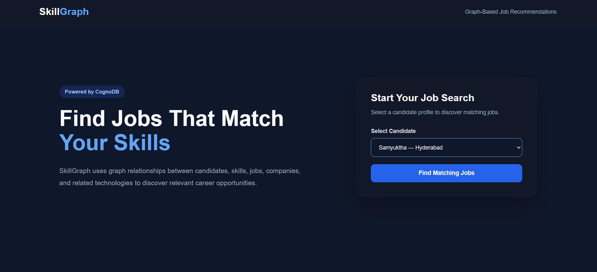
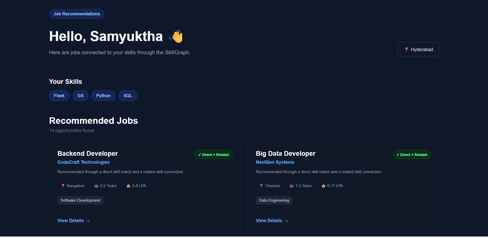
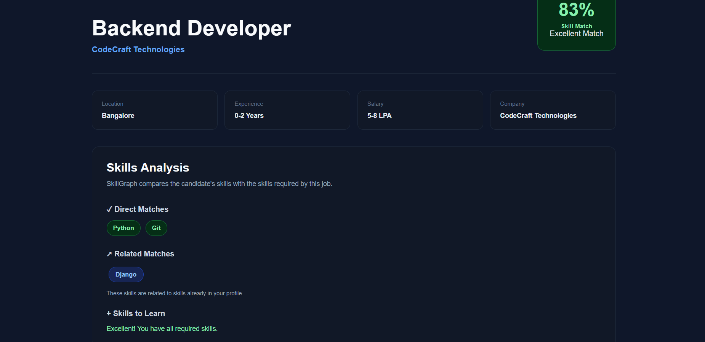

# SkillGraph – Intelligent Job & Skill Recommendation System

SkillGraph is a graph-based job recommendation application built with **Flask** and **CognoDB**.

The application connects candidates, skills, related skills, jobs, companies, and job categories using graph relationships. It recommends relevant jobs based on both **direct skill matches** and **related skill connections**.

---

## Live Demo

**Hosted Application:**  
https://skillgraph-280d.onrender.com

The application is deployed using Render and connects to CognoDB Cloud using environment variables.

---

## Problem Statement

Traditional job recommendation systems often compare candidate skills with job requirements using simple lists or relational joins.

SkillGraph uses a graph database to model relationships between:

- Candidates
- Skills
- Related Skills
- Jobs
- Companies
- Categories

This allows the application to discover job opportunities through connected skill paths.

For example, a candidate with Python may also be considered for jobs requiring related skills such as PySpark or Flask.

---

## Why a Graph Database?

A graph database is useful for SkillGraph because the recommendation process depends heavily on relationships between entities.

For example:

```text
Candidate
    |
 HAS_SKILL
    |
    v
  Python
    |
 RELATED_TO
    |
    v
  PySpark
    |
 REQUIRES
    |
    v
Data Engineer
    |
 POSTED_BY
    |
    v
DataFlow Technologies
```

This is a multi-hop relationship traversal:

```text
Candidate → Skill → Related Skill → Job → Company
```

In a relational database, the same recommendation would require multiple tables and JOIN operations.

With a graph database, these connected entities and relationships can be directly traversed using Cypher.

---

# Graph Data Model

## Nodes

| Node | Properties |
|---|---|
| Candidate | id, name, email, location |
| Skill | id, name, category |
| Job | id, title, location, experience, salary |
| Company | id, name, location |
| Category | id, name |

## Relationships

| Relationship | Description |
|---|---|
| `HAS_SKILL` | Candidate possesses a skill |
| `RELATED_TO` | One skill is related to another skill |
| `REQUIRES` | Job requires a skill |
| `POSTED_BY` | Job is posted by a company |
| `IN_CATEGORY` | Job belongs to a category |

---

## Graph Structure

```text
                     ┌─────────────┐
                     │   Company   │
                     └──────▲──────┘
                            │
                         POSTED_BY
                            │
                     ┌──────┴──────┐
                     │     Job     │
                     └──────┬──────┘
                            │
                         REQUIRES
                            │
                            ▼
                     ┌─────────────┐
                     │    Skill    │
                     └──────▲──────┘
                            │
                       RELATED_TO
                            │
                            ▼
                     ┌─────────────┐
                     │    Skill    │
                     └──────▲──────┘
                            │
                        HAS_SKILL
                            │
                     ┌──────┴──────┐
                     │  Candidate  │
                     └─────────────┘

Job ──IN_CATEGORY──> Category
```

---

# Recommendation Logic

SkillGraph uses two types of skill matches.

### 1. Direct Match

A candidate has the exact skill required by a job.

Example:

```text
Candidate → Python
Job → Requires Python
```

This is considered a strong match.

### 2. Related Match

A candidate does not have the exact required skill but has a related skill.

Example:

```text
Candidate
   |
HAS_SKILL
   |
Python
   |
RELATED_TO
   |
PySpark
   |
REQUIRES
   |
Data Engineer
```

This allows SkillGraph to recommend jobs that may be relevant even when the candidate does not have every exact required skill.

---

# Match Score

The application uses a simple weighted scoring system.

- Direct skill match = **1.0**
- Related skill match = **0.5**
- Missing skill = **0**

The final percentage is calculated based on the total required skills.

### Example

Suppose a job requires:

```text
Python
Git
Django
```

Candidate has:

```text
Python
Git
```

and Python is related to Django.

Score:

```text
Python = 1.0
Git    = 1.0
Django = 0.5
```

Total:

```text
2.5 / 3 × 100 ≈ 83%
```

The application displays:

```text
83% – Excellent Match
```

---

# Application Features

## Candidate Selection

Users can select a candidate from the application.

The application retrieves the candidate's skills from CognoDB.

## Job Recommendations

The application finds jobs based on:

- Direct skill matches
- Related skill matches
- Company
- Job category
- Location
- Experience
- Salary

## Skill Analysis

For each job, SkillGraph displays:

- Direct Matches
- Related Matches
- Skills to Learn
- Overall Match Percentage
- Match Category

Example:

```text
Direct Matches
Python
Git

Related Matches
Django

Skills to Learn
None

Match
83% – Excellent Match
```

## Job Details

Users can open an individual job and view:

- Job title
- Company
- Location
- Experience
- Salary
- Category
- Required skills
- Candidate skill analysis

---

# Technology Stack

## Backend

- Python
- Flask
- Neo4j Python Driver

## Database

- CognoDB Cloud
- Cypher Query Language

## Frontend

- HTML5
- CSS3
- JavaScript

## Deployment

- Render
- GitHub

## Configuration

- python-dotenv
- Environment variables

---

# Project Structure

```text
SkillGraph/
│
├── app.py
├── README.md
├── requirements.txt
├── .gitignore
│
├── database/
│   ├── seed.py
│   └── queries.cypher
│
├── templates/
│   ├── index.html
│   ├── jobs.html
│   └── job_details.html
│
└── static/
    ├── css/
    │   └── style.css
    │
    └── js/
        └── app.js
```

---

# Database Seed Data

The application includes realistic seed data for:

- Candidates
- Skills
- Related skills
- Jobs
- Companies
- Categories

The seed script creates the complete graph structure and relationships in CognoDB.

Run:

```bash
python database/seed.py
```

---

# Main Cypher Queries

The project includes the main Cypher queries in:

```text
database/queries.cypher
```

## 1. Get Candidates

```cypher
MATCH (c:Candidate)
RETURN
    c.id AS id,
    c.name AS name,
    c.location AS location
ORDER BY c.name
```

---

## 2. Get Candidate Skills

```cypher
MATCH (c:Candidate {id: $candidate_id})
      -[:HAS_SKILL]->(s:Skill)
RETURN
    s.id AS id,
    s.name AS name,
    s.category AS category
ORDER BY s.name
```

---

## 3. Direct Job Skill Matching

```cypher
MATCH (c:Candidate {id: $candidate_id})
      -[:HAS_SKILL]->(s:Skill)
MATCH (j:Job)
      -[:REQUIRES]->(s)
RETURN DISTINCT
    j.id AS id,
    j.title AS title
ORDER BY j.title
```

---

## 4. Multi-Hop Skill Recommendation

One of the key graph queries in SkillGraph is:

```cypher
MATCH (c:Candidate {id: $candidate_id})
      -[:HAS_SKILL]->(candidate_skill:Skill)
      -[:RELATED_TO]->(related_skill:Skill)
MATCH (j:Job)
      -[:REQUIRES]->(related_skill)
RETURN DISTINCT
    j.id AS id,
    j.title AS title,
    related_skill.name AS matched_skill
ORDER BY j.title
```

This traverses:

```text
Candidate
    ↓
HAS_SKILL
    ↓
Skill
    ↓
RELATED_TO
    ↓
Related Skill
    ↓
REQUIRES
    ↓
Job
```

This multi-hop traversal is one of the main reasons a graph database is appropriate for this application.

---

## 5. Job Company and Category

```cypher
MATCH (j:Job {id: $job_id})
      -[:POSTED_BY]->(company:Company)
MATCH (j)-[:IN_CATEGORY]->(category:Category)
RETURN
    j.id AS id,
    j.title AS title,
    j.location AS location,
    j.experience AS experience,
    j.salary AS salary,
    company.name AS company,
    category.name AS category
```

---

## 6. Job Required Skills

```cypher
MATCH (j:Job {id: $job_id})
      -[:REQUIRES]->(s:Skill)
RETURN s.name AS name
ORDER BY s.name
```

---

# Parameterized Queries

SkillGraph uses parameterized Cypher queries through the official Neo4j Python driver.

For example:

```python
query = """
MATCH (c:Candidate {id: $candidate_id})
      -[:HAS_SKILL]->(s:Skill)
RETURN s.name AS name
"""

result = session.run(
    query,
    candidate_id=candidate_id
)
```

User-provided values are passed as parameters instead of being concatenated directly into Cypher queries.

This improves security and follows good database query practices.

---

# Environment Variables

Database credentials are stored using environment variables.

Create a `.env` file locally:

```text
COGNODB_URI=your_cognodb_uri
COGNODB_USERNAME=your_cognodb_username
COGNODB_PASSWORD=your_cognodb_password
```

Do not commit the `.env` file to GitHub.

The `.gitignore` file contains:

```text
.env
__pycache__/
*.pyc
venv/
.venv/
```

For the hosted application, these values are configured through Render environment variables.

---

# Local Setup

## 1. Clone the Repository

```bash
git clone https://github.com/ThotaSamyuktha/SkillGraph.git
```

Move into the project:

```bash
cd SkillGraph
```

---

## 2. Create a Virtual Environment

Windows:

```bash
python -m venv venv
```

Activate it:

```bash
venv\Scripts\activate
```

---

## 3. Install Dependencies

```bash
pip install -r requirements.txt
```

---

## 4. Configure Environment Variables

Create a `.env` file in the project root:

```text
COGNODB_URI=your_cognodb_uri
COGNODB_USERNAME=your_cognodb_username
COGNODB_PASSWORD=your_cognodb_password
```

---

## 5. Seed the Database

Run:

```bash
python database/seed.py
```

This creates the required nodes and relationships in CognoDB.

---

## 6. Run the Application

```bash
python app.py
```

The application will run at:

```text
http://localhost:5000
```

---

# Error Handling

SkillGraph includes graceful database error handling.

If CognoDB becomes unavailable, the application displays a user-friendly error message instead of exposing database or connection details.

For example:

```text
Unable to connect to the database.
```

The application also handles:

- Candidate not found
- Job not found
- Recommendation loading errors
- Job detail loading errors

---

# Security

The project follows basic security practices:

- Database credentials are stored in environment variables.
- `.env` is excluded from Git.
- Passwords are not hard-coded in application source code.
- Cypher queries use parameters.
- Database connection details are not exposed in the UI.
- User-facing errors do not reveal sensitive database information.

---

# User Flow

The main application flow is:

```text
Open SkillGraph
      |
      v
Select Candidate
      |
      v
Load Candidate Skills
      |
      v
Find Matching Jobs
      |
      v
View Recommended Jobs
      |
      v
Open Job Details
      |
      v
Analyze Direct / Related / Missing Skills
```

---

# Example Recommendation Flow

For a candidate with:

```text
Python
SQL
Flask
Git
```

SkillGraph can identify:

```text
Python Developer
Backend Developer
Junior Python Developer
Data Engineer
Software Engineer
```

Some recommendations may be based on direct skills, while others may use related skill relationships.

---
# Demo Video

A short walkthrough demonstrating the SkillGraph application, job recommendations, and graph-based skill matching.

[▶ Watch the SkillGraph Demo Video](https://drive.google.com/file/d/1CHsr1CVvHHj-ytpre47DdEnwA3rjB151/view?usp=sharing)
# Screenshots

## Candidate Selection

Users can select a candidate profile to receive personalized job recommendations.



## Job Recommendations

SkillGraph displays jobs connected to the candidate's direct and related skills.



## Job Details and Skill Analysis

The job details page shows the skill match percentage along with direct matches, related matches, and skills to learn.



---

# Future Improvements

Possible future enhancements include:

- User authentication
- Candidate profile management
- More detailed skill relationships
- Job filtering by location and salary
- Resume-based skill extraction
- Personalized recommendation ranking
- Job application tracking
- Additional graph-based recommendation algorithms
- Admin interface for managing jobs and skills

---

# Project Highlights

SkillGraph demonstrates:

- Graph database modeling
- Relationship-based recommendation
- Multi-hop graph traversal
- Cypher query development
- Parameterized database queries
- Flask backend development
- HTML/CSS/JavaScript frontend
- Cloud database connectivity
- Environment-based configuration
- Cloud deployment
- Error handling

---

# Repository

GitHub Repository:

https://github.com/ThotaSamyuktha/SkillGraph

---

# Live Application

Try the deployed application:

https://skillgraph-280d.onrender.com

---

# Author

**Samyuktha Thota**

B.Tech – Information Technology
